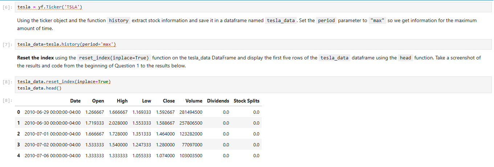
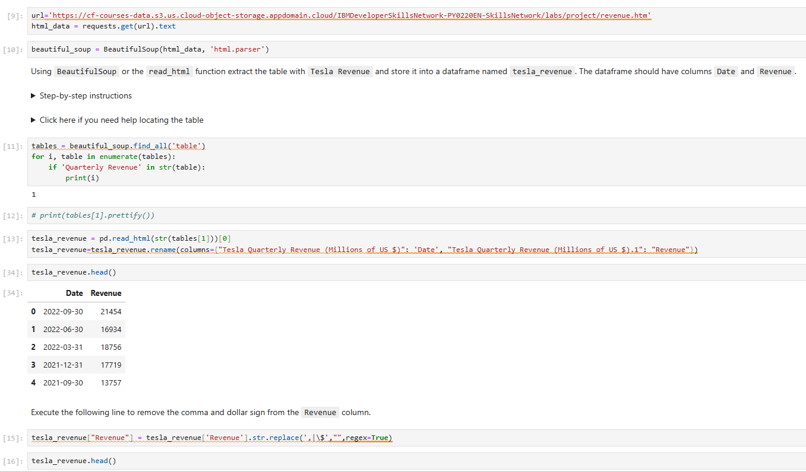
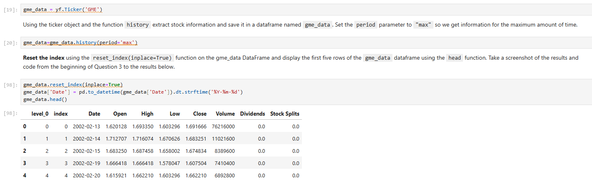
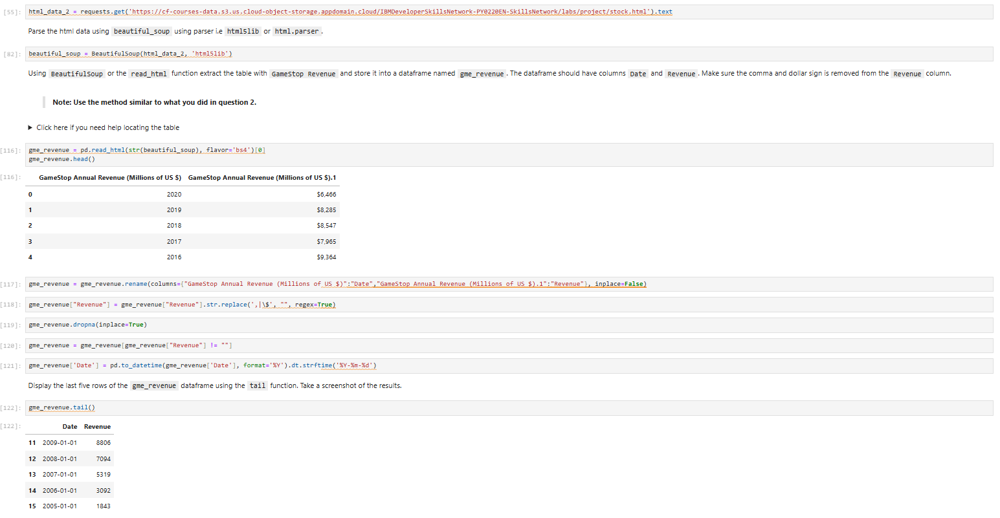
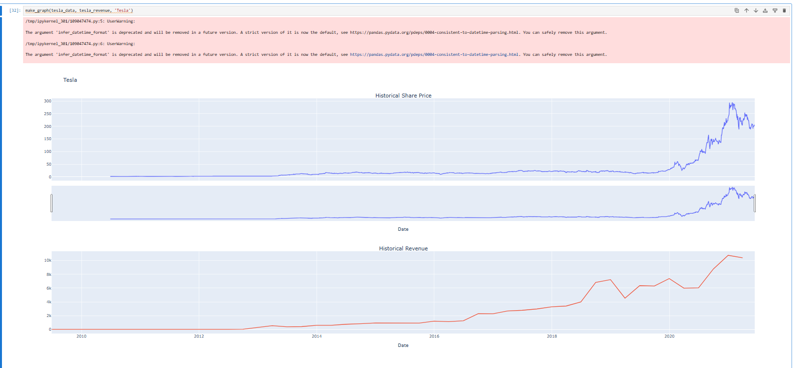
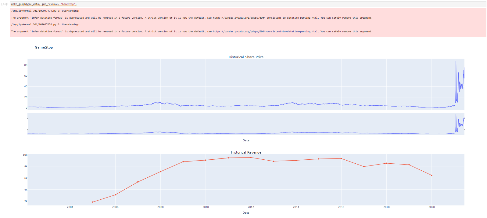

# IBM Python Project for Data Science

Lab: Peer-graded Assignment: Analyzing Historical Stock/Revenue Data and Building a Dashboard

## Question 1

## Question 2

## Question 3

## Question 4

## Question 5

## Question 6

